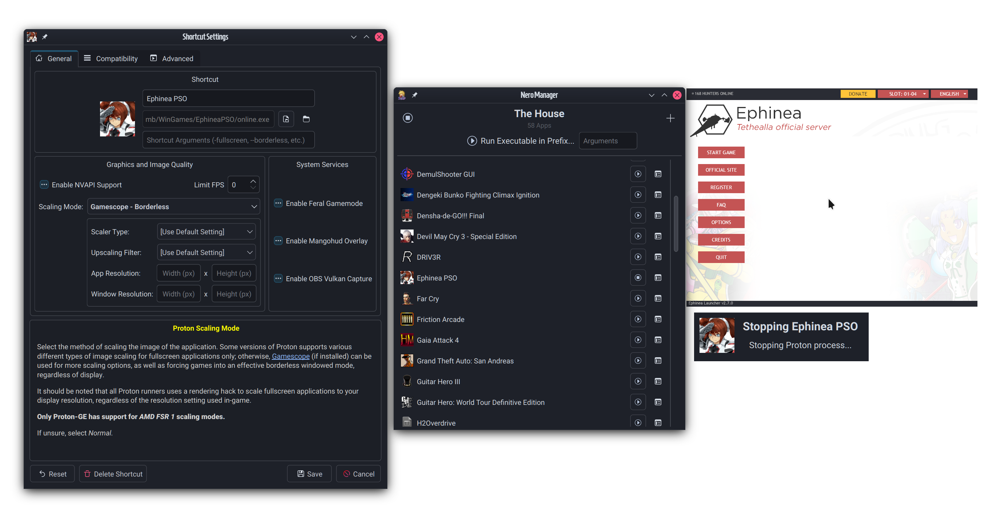

###### If you enjoy or if my work's helped you in any way,
[](https://ko-fi.com/Z8Z5NNXWL)

# Nero Manager
A fast and efficient Proton prefix runner and manager, using [umu](https://github.com/Open-Wine-Components/umu-launcher) as its backend for Steam-like compatibility with non-Steam applications.



## Highlights:
 - **It's fast:** Built with C++ and Qt, Nero Manager can load large lists of shortcuts (including icons) in less than half a second, while the native toolkit uses half the memory of other managers based on web browser engines.
 - **It's simple by default:** Create a prefix, add a shortcut, and done. Popups and settings are kept to a minimum to make adding new items as quick as possible.
 - **It's flexible when needed:** With comprehensive settings for both prefix and shortcut, even things that experts will use often like DLL overrides or configuring add-ons to run alongside umu like *Gamemode* and *Gamescope* can be configured graphically; all without having to type in long-winded command strings.
 - **It's streamlined:** Comprehensive descriptions of each setting and how to get the best out of them will make even a new user armed and ready with the knowledge to make full use of Proton's potential.
 - **It's integrated:*** A built-in Winetricks frontend skips (most of) the clunkiness, allowing quick and simple verbs installation either during or after creating a prefix, and per-shortcut version overrides can be set without using Winecfg.
 - **It works from the CLI:** Nero Manager is the integrated graphical frontend, made for creating, managing and running prefixes and shortcuts. But when run from the CLI, Nero's Runner component can launch an executable in a prefix, not unlike *Bottles.*
 - **It's got other stuff:** Easily install the Discord RPC bridge for each prefix, automagically apply SDL Controller layouts fix (e.g. for Nintendo controllers et al), set custom shortcut icons, use pre-run and post-run scripts, and *just play your darn games already.*

## Running
Nero can be started without arguments, which launches the Nero Manager frontend. This is where you make and setup your prefixes, and run shortcuts.

Nero can also be started with CLI arguments - a path to an executable will launch Nero's One-Time Runner popup, which prompts which prefix to run the executable in (using the prefix's current global settings) - else, a prefix to run in can also be specified alongside an executable for a prompt-less startup. See `nero-umu --help` for more info.

Because Nero itself does NOT manage runners--only prefixes--you need at least *one* Proton runner available in any of the following directories, in order of search priority:
 - `~/.steam/steam/compatibilitytools.d` (runners used with Steam)
 - `~/.local/share/Nero-UMU/compatibilitytools.d` (Nero's own runners dir, in case Steam isn't installed)
It's highly recommend to use utilities such as *[ProtonUp-Qt](https://github.com/DavidoTek/ProtonUp-Qt)* or *[ProtonPlus](https://github.com/Vysp3r/ProtonPlus)* to install new Steam runners.

Nero's been confirmed to build and work on the following:
 - Arch Linux (btw), w/ Qt 5.15.16 & Qt 6.8.1
 - Linux Mint 22, Qt 6.4

For Arch users, Nero can be installed from the AUR @ [`nero-umu`](https://aur.archlinux.org/packages/nero-umu) with your favorite helper app. For others, see building steps below (don't worry, it's not that hard!).

## Building
Requirements for building Nero from source:
 - `Qt6` - the Base and Network libraries are required.
   - If you're building with *Qt 5.x*, add the argument `-DNERO_QT_VERSIONS=Qt5` to the cmake command.
 - `QuaZip` - Needed for extracting zip archives (mainly the Discord RPC bridge utility).
   - For Qt 6.x, QuaZip additionally requires the Qt5Compat layer.

#### Arch
```
sudo pacman -Sy qt6-base qt6-tools qt6-5compat quazip-qt6
```
#### Fedora
```
sudo dnf install qt6-qtbase-devel qt6-qttools-devel qt6-qt5compat-devel quazip-qt6-devel
```
#### Debian/Ubuntu (& derivatives)
```
sudo apt install build-essential cmake qt6-base-dev qt6-tools-dev qt6-5compat-dev libquazip1-qt6-dev
```

Additionally, Nero uses the following external components, either implicitly or optionally:
 - `umu-launcher` [required] - the Proton runner backend, *duh.* Can either be installed directly from repos (currently in Arch's `multilib`), or via the package bundles in the releases page for your distro.
 - `curl` [optional] - for grabbing certain network components, currently only used for downloading the latest release of the Discord RPC bridge. TODO: See also [#12](https://github.com/SeongGino/Nero-umu/issues/12)
 - `winetricks` [optional] - if the current Proton runner for a prefix doesn't have a `protonfixes/winetricks` binary (normally included in the -GE fork, but not upstream), then system Winetricks will be used instead for Winetricks functionality - otherwise, all Winetricks functionality will be disabled.
 - `icoextract` + `icoutils` [optional] - used for getting icons from selected executables for shortcut entries. If neither of these exists, icons extraction will be skipped entirely, and only raw *.PNG* files can be used as icons - a placeholder icon vector from the XDG theme will be used if no image is available.

It's a very basic CMake system, so simply run:
```
mkdir build && cd build
cmake ..
make
```
The executable `nero-umu` will be created.

## Frequently Asked FAQs
### "Oh c'mon, ANOTHER launcher for Linux?"
#### Wait! There's a good reason for this!
Originally, I (Seong) had no intentions of making another launcher, as I was perfectly content using Bottles in combination with [Wine-GE](https://github.com/GloriousEggroll/wine-ge-custom). However, [as this fork of Wine has been deprecated for nearly a year now](https://github.com/GloriousEggroll/wine-ge-custom/releases/tag/GE-Proton8-26) in favor of *umu* and *Proton-GE,* this has left non-Steam non-other-launcher users like myself in a bit of a sticky situation; Wine-GE [was missing out on more and more](https://mstdn.games/@ThatOneSeong/113360310428612780) [critical updates for games](https://mstdn.games/@ThatOneSeong/113040976370840435), and it's grown increasingly clear that the Wine userbase was being (not-so-subtly) aggressively pushed towards Proton via *umu.* So it would be fair to assume that the popular launchers have all caught up with this trend, right?

*Ehhhhhhhhhhhhhhhhhh*

 - [Heroic](https://github.com/Heroic-Games-Launcher/HeroicGamesLauncher) is a launcher clearly aimed towards the Epic Games Store and GOG storefronts, and leans towards the one-prefix-per-game mentality made popular by Steam. While it's a pretty good launcher for storefront games, it's not very good for non-storefront titles, has a somewhat convoluted settings hierarchy, and uses Electron as a basis (so, a glorified Chromium browser. *yuck*).
 - [Lutris](https://github.com/lutris/lutris) is less so a *launcher* than it is a "preservation platform" - what this really means is that it's a frontend trying to fill several hats at once, with *Wine* (now Proton+umu) just being another component. Aside from it also leaning into the one-prefix-per-game mentality like Heroic, this leads to a UX problem where it overwhelms the user with a boatload of settings and toggles, very few of which are actually specific to or even useful for Wine and/or Proton--many of which don't have very descriptive tooltips.
 - [Bottles](https://github.com/bottlesdevs/Bottles) was, and in many ways debatably still, the go-to Wine prefix manager, as it does a pretty good job of streamlining the overall experience *without* hiding or abstracting away the fundamentals of how Wine works. It's a good educational tool as much as it is functional, however all of this only applies to *Wine* specifically - when you get to *Proton* support, this is where Bottles [shows its cracks](https://mstdn.games/@ThatOneSeong/113032628664912087), as it's (as of writing) [borderline dysfunctional](https://github.com/bottlesdevs/Bottles/issues/3485). It is also currently in the middle of a rewrite, with the original Bottles seemingly in a state of perpetual maintenance. Libadwaita also has its issues that can vary from person to person.

None of these are intended to be sleights against the developers, as they evidently do very good work *for the people these apps work for* - they just don't work for me and my use case, as someone who has limited disk space and often relies on one prefix for many applications and using Wine DLL overrides often. I'm also in the extra-unfortunate position of [being a YouTube video creator that talks about gaming on Linux](https://www.youtube.com/channel/UCKq6oQq_CnvzW4vhu-XpQ0g/), and the primary maintainer of [an open source Lightgun system](https://github.com/TeamOpenFIRE/OpenFIRE-Firmware) where a lot of the functionality and testing relies around *having an up-to-date Wine prefix* to launch and play Windows-based titles (because *fuck trying to use Windows*), so I would need to do *something.*

So here I am presenting to you: ***something.***

### "Why would I use your launcher over those others?"
Well, most apparent, Nero is meant to be the Proton-running stand-in for original *Bottles,* for people who are somewhat comfortable managing prefixes, but also made to be inviting for newbies who aren't quite knowledgeable about how Wine works. So if Bottles is your jam, there's a good chance you'll be able to jump right into Nero!

However, if you're looking for *deep* integration with other storefronts (i.e. GOG, EA, Uplay, etc.), you may be better served by either *Heroic* or *Lutris*. That said, actually setting up a prefix just for EA's app (or Origin) or Uplay *is actually very easy;* just running their installers is usually good enough for most people!

### "So what's the deal with the name?"
The backend tool that Nero relies on, *umu,* is *allegedly* based around a cooking utility from Polynesian culture - however, when I initially heard the name, [I could only think of one thing.](https://mstdn.games/@ThatOneSeong/112135472169805512)

*Nero* (full name *Nero Claudius*) is the 5th Roman Emperor, known for his contributions to diplomacy, trade, and culture. Some recounts claim that his reign was tyrannical and is viewed in a negative light by these interpretations; meanwhile, certain others made Nero into a genderbent reflection of their historical selves during the *Moon Cell Holy Grail War,* and often uses *umu* as a catchphrase. Go figure.
###### No relation to Nero, a primary protagonist of *Devil May Cry 4/5*, featuring Dante from the *Devil May Cry* series.

## TODOs (to do):
 - Add built-in downloader without external curl use ([#12](https://github.com/SeongGino/Nero-umu/issues/12))
 - Add `dxvk.conf` configuration dialog in shortcut settings.
 - Make process force-shutdown in runner more reliable
   - Since umu can't shut down the processes it spawns, Nero invokes a wineboot end command manually in the prefix, but sometimes the process is still running for some reason and needs external process killing)
 - Add favorites system
 - Add shortcuts list sorting system (currently only does ascending alphabetical)
 - Import shortcuts for newly installed applications to prefix Shortcuts list?
 - Add integration with SteamGridDB for downloading capsule art for potential favorites menu
 - Integrate umu's extensive protonfixes support (perhaps using OWC's fixes database?)
   - This might necessitate adding a distinction between "normal" prefixes, and one-title prefixes as protonfixes are geared towards the one-prefix-per-game thing.

## Things I likely WON'T do:
 - Setting custom environment variables
   - Aside from being a minor pain to parse, all possible options in Nero Manager should be something that's presented to the user - so if there is something you feel is missing, feel free to open up an issue and/or pull request. If you have a particular need for an esoteric CLI cheat code, prepend it to Nero itself in the meantime.
 - Set custom DXVK/VKD3D versions
   - If you really need this, make another Proton runner with these custom versions injected. Proton-GE already provides this for the most part.
 - Integrate with non-Steam stores
   - Other game launchers can be installed in their own prefix without too much difficulty, but specific support for this is unlikely as it doesn't fit with Nero's Prefix-first design
 - Use Wine instead of Proton
   - If you need Wine, Bottles would be a better fit.

## Special Thanks
 - Team OpenFIRE, for their optimism and support over the past year, and providing me the opportunity that allowed Nero to exist in the first place.
 - My supporters on Ko-fi, for their financial and emotional support over the past couple of years.
 - The friends that helped keep me sane along the way.
 - Emm, for being there when I needed them.
